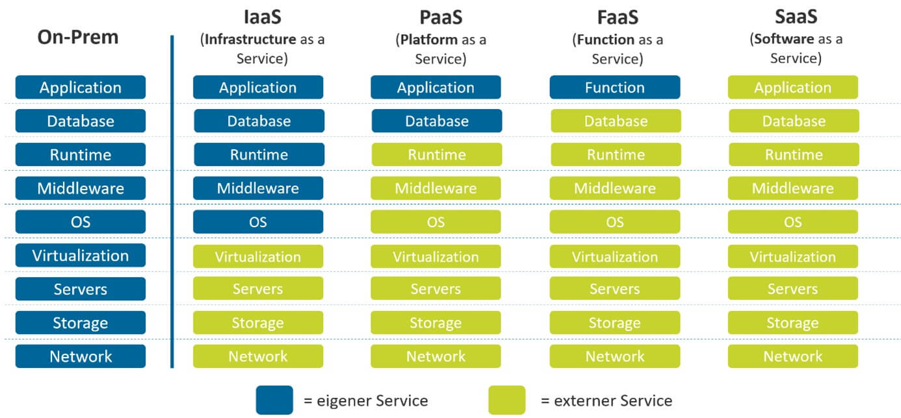

# Cheat Sheet: Cloud Computing & Container-Technologie

## 1. Cloud Computing Grundlagen

Cloud computing is a model that allows easy, on-demand access to a shared pool of IT resources (like servers, storage, or apps) over the internet. These resources can be set up or removed very quickly, with almost no effort or contact with the provider. 

Das Modell umfasst 5 wesentliche Merkmale, 3 Service-Modelle und 4 Deployment-Modelle.

### Die 5 wesentlichen Merkmale (Charakteristiken)
* **On-demand self-service:** Du kannst IT-Ressourcen wie Server, Speicherplatz oder Datenbanken selbst jederzeit bereitstellen, ohne jemanden beim Anbieter kontaktieren zu müssen.
* **Broad network access (Breiter Netzwerkzugriff):** Die Cloud-Dienste sind über das Internet erreichbar und funktionieren auf vielen verschiedenen Geräten von beliebigen Standorten aus. Cloud-Schnittstellen umfassen CLI (Command Line Interface), Web-UI und API.
* **Resource Pooling (Gemeinsame Ressourcennutzung):** Der Cloud-Anbieter stellt seine Hardware vielen Kunden gleichzeitig zur Verfügung (Multi-Tenant-Modell). Die Ressourcen werden dynamisch je nach Bedarf verteilt (Economy of Scale). Es gibt keine genaue Kontrolle über den physischen Server, oft aber über die grobe Region (z. B. Schweiz, Deutschland, Land, Datencenter). Anbieter nutzen oft Overcommitment (Verkauf von mehr Ressourcen, als physisch vorhanden sind).
* **Rapid Elasticity (Schnelle Skalierbarkeit):** Die Cloud kann Ressourcen sehr schnell vergrößern oder verkleinern, je nachdem wie viel Leistung gerade benötigt wird (z. B. mehr Server am Black Friday).
* **Measured Service (Messbarer Service):** Die Nutzung der Cloud wird automatisch gemessen und überwacht, sodass du nur für das bezahlst, was du tatsächlich nutzt.

---

## 2. Service-Modelle

Die Service-Modelle bestimmen, welchen Teil der Infrastruktur wir kaufen und klären die Verantwortlichkeiten.

* **Software as a Service (SaaS):** Du nutzt fertige Programme des Anbieters, die komplett in der Cloud laufen (z. B. Gmail, Netflix). Es ist keine Installation oder Wartung nötig; der Zugriff erfolgt über den Webbrowser oder eine App. Du mietest die Software nur und der Anbieter übernimmt alle Updates.
* **Platform as a Service (PaaS):** Der Anbieter stellt dir eine fertige Arbeitsumgebung (Plattform) zur Verfügung, auf der du eigene Programme entwickeln und laufen lassen kannst. Du kontrollierst nur deine Anwendungen, während der Anbieter sich um Server und Betriebssysteme kümmert (ideal für Entwickler).
* **Infrastructure as a Service (IaaS):** Du mietest die reine IT-Hardware (virtuelle Server, Speicher, Netzwerk). Du bist selbst für Betriebssystem, Sicherheitsupdates und Software-Installationen verantwortlich. Es ist das flexibelste Modell mit dem größten eigenen Aufwand.

---

## 3. Deployment-Modelle

* **Private Cloud:** Diese Cloud wird ausschließlich von einem einzigen Kunden bzw. einer Organisation genutzt. Du kannst selbst entscheiden, welche Hardware eingesetzt wird, was maximale Sicherheit bietet, aber am teuersten ist.
* **Community Cloud:** Wird von mehreren Organisationen betrieben oder genutzt, die gleiche Interessen oder Sicherheitsvorgaben haben (z. B. Krankenhäuser). Man teilt sich Kosten und Aufwand.
* **Public Cloud:** Die Cloud-Dienste sind für die breite Öffentlichkeit frei zugänglich, und du hast keinen direkten Zugang zu den Servern und Gebäuden. Extrem flexibel und günstig, aber mit weniger Kontrolle über den genauen Speicherort.
* **Hybrid Cloud:** Eine Mischform aus mehreren Modellen (meist Private und Public Cloud). Ermöglicht hohe Sicherheit für sensible Daten (Private) kombiniert mit schneller Skalierbarkeit für Spitzenzeiten (Public).

---

## 4. Cloud-Dienstleistungen & Anbieter

Konkrete Dienste in der Cloud lassen sich in vier Kernbereiche aufteilen:
* **Rechenleistung (Compute):** Virtuelle Server für Programme oder Webseiten.
* **Speicherplatz (Storage):** Digitaler Platz für Backups, Bilder und Dokumente.
* **Datenbanken (Databases):** Fertige Systeme, die sich selbst updaten und sichern.
* **Netzwerk (Networking):** Virtuelle Router und Firewalls für sichere Verbindungen.

**Die wichtigsten Anbieter auf dem Markt:**
* **US-Hyperscaler ("Die Großen Drei"):** Amazon Web Services (AWS), Microsoft Azure, Google Cloud (GCP).
* **Lokale europäische Alternativen:** Hetzner, OVHcloud, Swisscom Cloud (wichtig für strengen, regionalen Datenschutz).

### Vergleich der US-Hyperscaler

| Kriterium | Amazon Web Services (AWS) | Microsoft Azure | Google Cloud Platform (GCP) |
| :--- | :--- | :--- | :--- |
| **Kernfokus** | Unangefochtener Marktführer; größte Vielfalt; riesiges Ökosystem. | Perfekt für Unternehmen; Integration in Microsoft-Infrastrukturen. | Führend bei Big Data, KI/ML und Container-Technologie. |
| **Speicher** | S3 (Objekt), EBS (Block), EFS (Datei). | Blob Storage (Objekt), Disk Storage (Block), Azure Files (Datei). | Cloud Storage (Objekt), Persistent Disk (Block), Filestore (Datei). |
| **Datenbanken** | RDS, DynamoDB (NoSQL), Aurora. | SQL Database, Cosmos DB (NoSQL). | Cloud SQL, Cloud Spanner, Bigtable (NoSQL). |
| **KI / ML** | SageMaker, Bedrock. | Azure OpenAI (ChatGPT), Machine Learning. | Vertex AI (Gemini), BigQuery. |
| **Netzwerk** | VPC, Route 53, CloudFront. | VNet, Azure DNS, ExpressRoute. | Globales VPC, Cloud DNS, Cloud CDN. |
| **Vorteile** | Größte Feature-Auswahl; riesige Community; First-Mover-Vorteil. | Perfekt für Microsoft-Umgebungen; starke Hybrid-Cloud; Rabatte. | Spitzenreiter bei Kubernetes; hervorragende KI-Tools; schnelles Netzwerk. |
| **Nachteile** | Unübersichtliche Preise; steile Lernkurve durch zu viele Dienste. | Doku oft unübersichtlich; Bindung an den Microsoft-Kosmos. | Weniger Nischen-Dienste; weniger Fokus auf alte Enterprise-Systeme. |

---

## 5. Betriebs- und Sicherheitskonzepte

### Monitoring vs. Logging
* **Monitoring (Der Tacho):** Misst den aktuellen Zustand in Echtzeit über Zahlen/Metriken (z. B. CPU-Auslastung bei 80%). Beantwortet die Frage: Wie gesund ist das System jetzt? Zeichnet Live-Echtzeitdaten auf.
* **Logging (Die Blackbox):** Schreibt ein chronologisches Tagebuch aller Ereignisse als Text. Beantwortet die Frage: Was genau ist wann passiert? Zeigt einzelne Events auf.

### Vor- und Nachteile der Cloud
* **Vorteile:** Günstiger Start (keine Vorab-Hardwarekosten), einfaches Skalieren bei Anstürmen, ausfallsicher (Verteilung auf mehrere Rechenzentren), und keine Hardware-Wartung für den Kunden.
* **Nachteile:** Internet-Abhängigkeit, Anbieterbindung (Vendor Lock-in), rechtliche Aspekte/Datenschutz (DSGVO vs. US-Server), und Kostenrisiko bei falscher Konfiguration.

### Shared Responsibility Model
* **Anbieter-Verantwortung:** Zuständig für die Sicherheit DER Cloud (Hardware, Strom, physischer Schutz von Gebäuden).
* **Kunden-Verantwortung:** Zuständig für die Sicherheit IN DER Cloud (Daten, Passwörter, Software-Updates und Zugriffsrechte).
* **Verschiebung nach Modell:** Bei IaaS musst du das OS absichern, bei PaaS nur deine Apps, und bei SaaS lediglich deine Logins.

---

## 6. Container-Technologie vs. Virtuelle Maschinen

Die Container-Virtualisierung verpackt Anwendungen inklusive Code, Laufzeitumgebung und Bibliotheken in eine isolierte Umgebung.

| Kriterium | Virtuelle Maschine (VM) | Container |
| :--- | :--- | :--- |
| **Architektur** | Jede VM hat ein eigenes, vollständiges Gast-Betriebssystem und einen eigenen Kernel. | Alle Container teilen sich den Kernel des Host-Betriebssystems. |
| **Startzeit** | Dauert Minuten (komplettes OS bootet). | Dauert Sekunden (schnellerer Start, da Prozesse fast augenblicklich starten). |
| **Größe** | Groß (Gigabyte-Bereich). | Klein (Megabyte-Bereich). |
| **Ressourcen** | Höherer Overhead; CPU/RAM fest reserviert. | Minimaler Overhead; direkter und flexibler Ressourcenverbrauch vom Host. |
| **Portabilität** | Bedingt portabel. | Extrem portabel (Run anywhere). |

**Wann VMs besser sind:**
VMs können nicht immer ersetzt werden. Sie sind zwingend erforderlich bei unterschiedlichen Betriebssystemen (z.B. Windows-App auf Linux-Server), tiefen Kernel-Eingriffen oder für maximale Sicherheitsisolation im Multi-Tenancy-Betrieb (z. B. bei Banken).

### Das Kern-Trio der Container
* **Image (Das Backrezept):** Ein unveränderbares Template als Bauplan, das Code und Abhängigkeiten enthält.
* **Container (Der fertige Kuchen):** Die lebendige, laufende Instanz eines Images mit einer beschreibbaren Schicht.
* **Registry (Das Kochbuch / Der Laden):** Das Archiv zum Hoch- und Herunterladen von Images (z.B. Docker Hub).

### Unveränderbare Infrastruktur (Immutable Containers)
Ein laufender Container wird niemals im Betrieb gepatcht. Bei Änderungen wird der alte Container gelöscht, ein neues Image gebaut und gestartet. Dies verhindert Konfigurations-Drifts und ermöglicht perfekte Vorhersehbarkeit.

---

## 7. Container-Orchestrierung

Bei Hunderten Containern würde ohne einen "Orchester-Dirigenten" Chaos ausbrechen. Orchestrierungssysteme arbeiten deklarativ: Du definierst den Soll-Zustand, das System überwacht den Ist-Zustand und greift bei Ausfällen automatisch ein (Auto-Healing, Scheduling, Load Balancing).

**Bekannte Produkte & Tools:**
* **VM-Produkte:** VMware vSphere/ESXi, Microsoft Hyper-V, KVM, Oracle VirtualBox, Proxmox VE.
* **Container-Engines:** Docker, Podman (sicher ohne Root-Zwang), containerd, cryo, LXC/LXD.
* **Orchestrierung:** Kubernetes (K8s), OpenShift (Docker Orchestration Enhancement für Firmen), Docker Swarm, Docker Compose, Amazon ECS.

### Self-Managed vs. Fully Managed
* **Self-Managed:** Volle Kontrolle, kein Lock-in, aber extrem hoher Wartungsaufwand und Experten-Know-how nötig.
* **Fully Managed (z.B. AWS EKS, Azure AKS):** Provider übernimmt Wartung und Skalierung der Plattform; minimiert Arbeit, kostet aber extra und führt zu Abhängigkeiten.

---

## 8. Skalierung & Deployment-Strategien

Cloud-Systeme bevorzugen die **horizontale Skalierung (Scale Out)**: Statt den Server größer zu machen (Vertikal/Scale Up), werden neue Instanzen hinzugefügt ("geklont"). Dies ist unendlich skalierbar und extrem ausfallsicher.

**Deployment-Strategien für neue Software-Versionen:**
* **Recreate:** Alte Container werden abgeschaltet, bevor neue gestartet werden (verursacht spürbare Downtime).
* **Rolling Update:** Container werden schrittweise ersetzt. Keine Downtime, aber alte und neue Versionen laufen kurzzeitig parallel.
* **Blue-Green Deployment:** Identische Umgebungen; Traffic wird nach erfolgreichem Test mit einem Klick von "Blau" (Alt) auf "Grün" (Neu) umgeschaltet. Teuer wegen doppelter Infrastruktur, aber perfektes Rollback.
* **Canary Deployment:** Neue Version wird zuerst nur für einen sehr kleinen Teil der Nutzer (z.B. 5%) freigeschaltet, um Fehler zu minimieren.

---

## 9. Zusätzliche DevOps-Notizen

* **Infrastructure as Code (IaC):** z. B. Verwaltung der Server per Terraform.
* **Zweck eines Dockerfiles:** Es dient als Bauplan, der beschreibt, wie ein Image gebaut wird (Bauplan für den Build-Prozess). Beispiele für Workflows sind Git Workflow und Docker Workflow.
* **Troubleshooting-Fokus:** Deployment, Events, Pods.
* **Speichereigenschaften:** Dateinamen und Directories sind persistent.